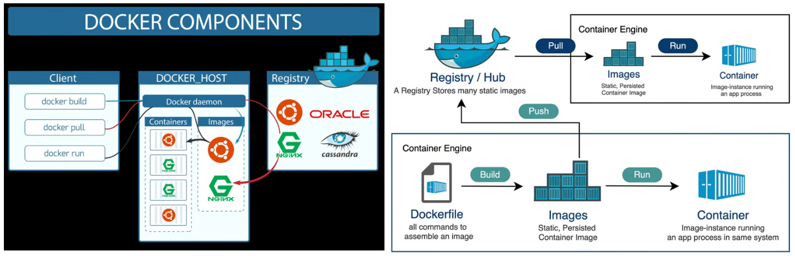

#### Side Quest: Software applications
```
Nginx: A web server (like Apache2), used as a reverse proxy, load balancer, and HTTP cache
Purpose: Serves websites, handles HTTP/HTTPS traffic
   docker run -d -p 8080:80 nginx
   Browser: http://localhost:8080

Cassandra: A distributed NoSQL database
Purpose: Stores data across multiple nodes with high availability
   docker run -d --name my-cassandra cassandra
   GUI: Cassandra client or Python driver

Oracle Database: A relational database (like MySQL or PostgreSQL)
Purpose: Store structured data with SQL queries.
docker run -d --name oracle-db -p 1521:1521 container-registry.oracle.com/database/enterprise:latest
```

#### Why use Docker
```
Use Docker if you:
    Work on a team
    Deploy to any server/cloud
    Want reliable, reproducible environments ❤️ Your laptop different env than other peoples
    Want to move toward Kubernetes / DevOps
Don’t use Docker if you:
    Are just learning Python scripts locally
    Have no need to share or deploy the project
```

# Docker vs Kubernetes
```
Docker (Build, package, distribute applications in isolated environments called containers)
    Container contain:
        Dependencies
        Code
        System Tools
        System Libraries
        Code
    GUI: Docker Desktop and Docker Dashboard

   # Look at CLIENT in above image
   Step 1: Dockerfile describes how to build a container image
      # Sample Dockerfile
      FROM python:3.9-slim				        # tells Docker to use python image or node.js
      WORKDIR /app					            # setup a working directory
      COPY . /app					            # copy the app files		
      RUN pip install -r requirements.txt		# install dependencies
      CMD [“python”, “app.py”]			        # run app
    Step 2: Docker Image is result of Dockerfile, contains everything needed to run app push to DockerHub
    Step 3: Docker Container is running instance of Docker image using docker run

Kubernetes (Container Orchestration Platform manages across multiple machines)
   Manages Containers by grouping into Pods
      Scaling
      Load Balancing
      Self Healing

    deployment.yaml
        apiVersion: apps/v1
        kind: Deployment
        metadata:
        name: my-app
        spec:
        replicas: 3
        selector:
            matchLabels:
                app: my-app
        template:
            metadata:
                labels:
                    app: my-app
        spec:
            containers:
                name: my-container
                image: nginx

   GUI: Kubernetes Dashboard
```

#### Side Quest: GitHub vs DockerHub
```
GitHub: https://github.com/
    Purpose: Stores source code (files)
DockerHub: https://hub.docker.com/
    Purpose: Stores container images and able to run
```

# Example: Simple Project w/ Docker
```
# Step 1: Create app.py
print("Hello from Docker!")

# Step 2: Create Dockerfile (no extension) in same folder as app.py
FROM python:3.9-slim       	    # Use a minimal Python image
WORKDIR /app               	    # Set working directory inside container
COPY . /app                	    # Copy your local files to container
CMD ["python", "app.py"]        # Run your script when container starts

# Step 3: Build Docker Image in terminal
# docker build: create an Docker image
# -t hello-docker: name the image hello-docker
docker build -t hello-docker .

# Step 4: Run the Docker Container locally
docker run hello-docker

# Step 5: Push image to Docker Hub (stores built container)
# docker tag: renames or adds a label to your image so Docker knows where to push it  
docker tag hello-docker duprogramllc/hello-docker
docker login					# Optional
docker push duprogramllc/hello-docker

Browser: https://hub.docker.com/r/duprogramllc/hello-docker

# Teammates can pull and run it 
docker pull duprogramllc/hello-docker
docker run duprogramllc/hello-docker
```

# Combined Simple Project with Kubernetes
```
# Step 1: Need a Kubernetes cluster use Minikube (local cluster)
minikube start

# Step 2: Make sure kubectl works 
kubectl get nodes

Step 3: Create deployment.yaml in same folder as app.py
apiVersion: apps/v1
kind: Deployment
metadata:
  name: hello-deployment
spec:
  replicas: 1
  selector:
    matchLabels:
      app: hello-app
  template:
    metadata:
      labels:
        app: hello-app
    spec:
      containers:
      - name: hello-container
        image: duprogramllc/hello-docker
        imagePullPolicy: Always
        ports:
        - containerPort: 80

Step 4: Apply the Deployment 
kubectl apply -f deployment.yaml
# Check that pods are running 
kubectl get pods

Step 5: Expose the Deployment (Create a Service) so you can access it
# Note: Python app prints output to terminal, it does not serve HTTP, so the above doesn’t display anything in browser — it just runs 
kubectl expose deployment hello-deployment --type=NodePort --port=80 –target-port=80
# check the service 
kubectl get service hello-deployment
# watch the pod logs 
kubectl logs -l app=hello-app –follow
```

# Optional: Modify app.py run Python script as a web server to be able view in Browser
```
app.py
from flask import Flask
app = Flask(__name__)

@app.route("/")
def hello():
    return "Hello from Kubernetes!"

app.run(host="0.0.0.0", port=80)

Optional Step: Expose service again
kubectl get service
# Open it in Browser (Minikube only)
minikube service hello-deployment

Browser: http://127.0.0.1:31234/
```

#### Side Quest: Docker vs Python virtual environment (venv)
```
venv
    only isolates Python packages 
Docker isolates:
	OS version
	System libraries
	Runtime settings
	Other languages or tools

python3 -m venv venv
    # Pick 1 base on OS
    macOS / Linux : source venv/bin/activate
    Window(CMD): venv\Scripts\activate
    Window(PowerShell): venv\Scripts\Activate.ps1
pip install flask
deactivate
```